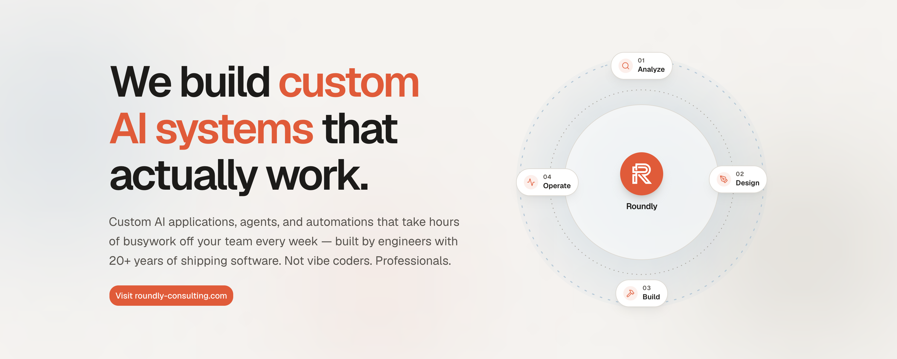

<!-- Cover — click to visit roundly-consulting.com -->
<a href="https://roundly-consulting.com/?utm_source=github&utm_medium=org_profile&utm_campaign=readme_cover">
  
</a>

<div align="center">

# Roundly Consulting

**Custom AI applications, agents, and automations that take hours of busywork off your team every week.**

Built by engineers with 20+ years of shipping software. Not vibe coders. Professionals.

[](https://roundly-consulting.com/?utm_source=github&utm_medium=org_profile&utm_campaign=readme_badge)
[](https://roundly-consulting.com/contact?utm_source=github&utm_medium=org_profile&utm_campaign=readme_cta)

</div>

---

## Anyone can prompt an app. Few can engineer one.

AI makes demos easy and production hard. We ship production.

We're a team of developers, designers, DevOps engineers and project managers who've been shipping software since long before large language models existed. When AI made it possible to build faster, we didn't lower the bar — we automated our own workflows around it. Agents write code here; **engineers review, secure, and own every line that ships.**

<div align="center">

| `100+` | `40+` | `30+` | `20,000+` |
|:---:|:---:|:---:|:---:|
| Apps & websites shipped | Security audits | Cloud infrastructures | Hours of consulting |

</div>

---

## 🛠️ What we build

From idea to autonomous operation — six ways we put AI to work in your company, all engineered to production standards.

| | Service | What it does |
|---|---|---|
| 🤖 | **Custom AI applications** | AI products built end-to-end: LLM features, retrieval and knowledge systems, full applications designed, shipped and operated. |
| 🔗 | **Agentic systems & AI agents** | Agents that plan and execute multi-step work across your tools — with guardrails, evals, and humans in the loop where it matters. |
| ⚙️ | **Business automation** | Operations that run themselves: documents, email, data flows, approvals — measured in hours saved. |
| 🔌 | **AI integrations** | LLMs wired into the systems you already use — CRM, ERP, internal tools. |
| 🧱 | **Product engineering** | Web, mobile, APIs — the classic craft underneath. |
| 🛡️ | **Security & monitoring** | Audited, monitored, and observable — you always see what your systems do. |

➡️ **[Explore all services →](https://roundly-consulting.com/services?utm_source=github&utm_medium=org_profile&utm_campaign=readme_services)**

---

## 🔄 How we work

**Analysis first, autonomy last.** We say "vibe coding" out loud so you don't have to wonder — this is the opposite.

```
  01 · Analyze  →  02 · Design  →  03 · Build  →  04 · Operate
  Workflow &       Architecture,    Automated AI    Monitoring,
  operations       UX, and the      workflows with  performance,
  analysis         security model   senior review   iteration
```

Senior review on every change. Security and quality gates between code and your production. Documentation and handover so you can run, extend, and own what we build. No black boxes.

---

## 💡 Where AI already does the work

Real prototypes across industries — what they solve, how they work, and what changes when AI takes over the busywork.

`Security` · `Finance` · `Data analysis` · `Property management` · `Customer support` · `Sales & CRM` · `Legal & compliance` · `HR & recruiting` · `Operations & logistics`

➡️ **[See the use cases →](https://roundly-consulting.com/use-cases?utm_source=github&utm_medium=org_profile&utm_campaign=readme_usecases)**

---

## 📦 Open source

We build products from reusable blocks — and we publish those blocks. **50+ Laravel packages, free and MIT-licensed**, the same code we run in client projects every day. Native, typed, and mostly zero third-party runtime dependencies.

| Area | Packages |
|---|---|
| **Auth & security** | [Auth](https://github.com/roundly-consulting/auth-for-laravel) · [Passkeys](https://github.com/roundly-consulting/passkeys-for-laravel) · [Two-Factor](https://github.com/roundly-consulting/two-factor-for-laravel) · [JWT](https://github.com/roundly-consulting/jwt-for-laravel) · [Refresh Tokens](https://github.com/roundly-consulting/refresh-tokens-for-laravel) · [Permissions](https://github.com/roundly-consulting/permissions-for-laravel) · [Crypto](https://github.com/roundly-consulting/crypto-for-laravel) · [Sentinel](https://github.com/roundly-consulting/sentinel-for-laravel) |
| **Commerce** | [Money](https://github.com/roundly-consulting/money-for-laravel) · [Purchases](https://github.com/roundly-consulting/purchases-for-laravel) · [Shops](https://github.com/roundly-consulting/shops-for-laravel) · [Credits](https://github.com/roundly-consulting/credits-for-laravel) · [Coupons](https://github.com/roundly-consulting/coupons-for-laravel) · [Advertisements](https://github.com/roundly-consulting/advertisements-for-laravel) · [Trading Analytics](https://github.com/roundly-consulting/trading-analytics-for-laravel) |
| **Content & media** | [Media Library](https://github.com/roundly-consulting/media-library-for-laravel) · [QR](https://github.com/roundly-consulting/qr-for-laravel) · [Posts](https://github.com/roundly-consulting/posts-for-laravel) · [Translatable](https://github.com/roundly-consulting/translatable-for-laravel) · [Sluggable](https://github.com/roundly-consulting/sluggable-for-laravel) |
| **Social & engagement** | [Comments](https://github.com/roundly-consulting/comments-for-laravel) · [Messages](https://github.com/roundly-consulting/messages-for-laravel) · [Reviews](https://github.com/roundly-consulting/reviews-for-laravel) · [Likes](https://github.com/roundly-consulting/likes-for-laravel) · [Connections](https://github.com/roundly-consulting/connections-for-laravel) · [Contacts](https://github.com/roundly-consulting/contacts-for-laravel) · [Campaigns](https://github.com/roundly-consulting/campaigns-for-laravel) |
| **Workflow & lifecycle** | [Forms](https://github.com/roundly-consulting/forms-for-laravel) · [Appointments](https://github.com/roundly-consulting/appointments-for-laravel) · [Opening Hours](https://github.com/roundly-consulting/opening-hours-for-laravel) · [Approvals](https://github.com/roundly-consulting/approvals-for-laravel) · [Requests](https://github.com/roundly-consulting/requests-for-laravel) · [Lifecycle](https://github.com/roundly-consulting/lifecycle-for-laravel) · [Teams](https://github.com/roundly-consulting/teams-for-laravel) · [Onboarding](https://github.com/roundly-consulting/onboarding-for-laravel) · [Reports](https://github.com/roundly-consulting/reports-for-laravel) |
| **Data & modeling** | [Metrics](https://github.com/roundly-consulting/metrics-for-laravel) · [Query Builder](https://github.com/roundly-consulting/query-builder-for-laravel) · [Addresses](https://github.com/roundly-consulting/addresses-for-laravel) · [Attributes](https://github.com/roundly-consulting/attributes-for-laravel) · [Options](https://github.com/roundly-consulting/options-for-laravel) · [Enums](https://github.com/roundly-consulting/enums-for-laravel) |
| **Infrastructure** | [Kubernetes API](https://github.com/roundly-consulting/kubernetes-api-for-laravel) · [Certificates](https://github.com/roundly-consulting/certificates-for-laravel) · [Git](https://github.com/roundly-consulting/git-for-laravel) · [Alerts](https://github.com/roundly-consulting/alerts-for-laravel) · [Geolocation](https://github.com/roundly-consulting/geolocation-for-laravel) · [Google Places](https://github.com/roundly-consulting/google-places-for-laravel) · [HTTP Client Rate Limits](https://github.com/roundly-consulting/http-client-rate-limits-for-laravel) · [Plausible](https://github.com/roundly-consulting/plausible-for-laravel) |
| **Package tooling** | [Package Toolkit](https://github.com/roundly-consulting/package-toolkit-for-laravel) · [Testing](https://github.com/roundly-consulting/testing-for-laravel) |

> **Building with an AI coding agent?** *Roundly for Laravel* gives your agent one registry of every package — install commands and docs included — so it reaches for tested code instead of writing it from scratch. [Read the registry docs →](https://roundly-consulting.com/open-source/docs/roundly-for-laravel?utm_source=github&utm_medium=org_profile&utm_campaign=readme_registry)

➡️ **[Browse the package catalogue →](https://roundly-consulting.com/open-source?utm_source=github&utm_medium=org_profile&utm_campaign=readme_opensource)**

---

## 💛 Support our open-source work

Publishing code is the easy part. Keeping it secure and current for years is the work your support pays for:

- 🛡️ Security fixes and vulnerability patching
- ⬆️ Framework upgrades — Laravel 12 & 13 support
- ✅ Testing and CI infrastructure
- 📖 Documentation in English and Slovak

<div align="center">

[](https://www.patreon.com/cw/roundly)
[](https://donate.stripe.com/dRmeVe8FX5PF1Qd9pXcEw00)

</div>

**Patreon** membership has the most impact — recurring support lets us plan maintenance months ahead. **Stripe** takes a one-time donation, no account needed.

<details>
<summary><b>Donate in crypto</b> — BTC · ETH · BNB · SOL</summary>

| Coin | Network | Address |
|---|---|---|
| Bitcoin (BTC) | Bitcoin | `bc1qnax9v07qwss4d3d95tyl58w3yht6awuujk5y8g` |
| Ethereum (ETH) · BNB | Ethereum (ERC-20) · BNB Smart Chain (BEP-20) | `0x4cC2864Bf91a530FA6e8939aC086192EFa0c659A` |
| Solana (SOL) | Solana | `4AAjSTXBL7HZJXZFwFJknks2nQKu1gfU4hCqxe3B1qDb` |

</details>

**No budget? You can still help** — ⭐ star our repositories, report bugs, and recommend our packages to your team.

➡️ **[All the ways to support us →](https://roundly-consulting.com/support-us?utm_source=github&utm_medium=org_profile&utm_campaign=readme_support)**

---

## 🧰 The stack we trust


---

## 🤝 Affiliate program — refer a client, earn up to 12%

Know a company that needs AI or custom software? Introduce them. Once the project is delivered and paid, you earn a commission — and your rate grows with every finished project.

<div align="center">

| Starter | Growth | Strategic | Executive |
|:---:|:---:|:---:|:---:|
| **5%** | **7%** | **9%** | **12%** |
| 1–2 projects | 3–5 projects | 6–9 projects | 10+ projects |

</div>

Tiers are permanent — you never drop back down.

1. **Introduce** — a warm email or the form, straight to a decision-maker.
2. **We scope** — a tailored quote within 48 hours.
3. **We deliver** — no involvement needed on your side.
4. **You get paid** — within 14 days of the final invoice being paid.

You earn on every project the client signs within **12 months** of your introduction. Built for consultants & advisors, agencies & studios, IT companies, and founders & operators. Cold lists and companies already talking to us don't count.

➡️ **[Become a partner →](https://roundly-consulting.com/affiliate-program?utm_source=github&utm_medium=org_profile&utm_campaign=readme_affiliate)**

---

## 📬 Start automating today

Tell us about your operations — we'll tell you what AI can take off your plate. A 30-minute intro call is the fastest way to start, and we reply within one business day.

<div align="center">

[](https://roundly-consulting.com/contact?utm_source=github&utm_medium=org_profile&utm_campaign=readme_footer_cta)

**Roundly Consulting s.r.o.** · Bratislava, Slovakia 🇸🇰 · Serving clients across Europe

[Website](https://roundly-consulting.com/?utm_source=github&utm_medium=org_profile&utm_campaign=readme_footer) ·
[X](https://twitter.com/roundly_) ·
[Instagram](https://www.instagram.com/roundly_consulting/) ·
[Facebook](https://www.facebook.com/profile.php?id=100093105116152) ·
[YouTube](https://youtube.com/@RoundlyConsulting)

</div>
